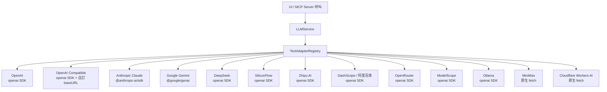

# API_SURFACE.md — API 與介面參考

> 版本：2.9.6 | 更新日期：2026-04-30（增量更新基於 commit `3824b64`） | 語言：繁體中文（術語保留英文原文）
>
> 註（2026-04-30）：本次無 MCP / Core service / IPC channel 介面層異動；DeepSeek adapter 升級到 v4 模型支援，但 provider id 仍為 `deepseek`，介面不變。前端新增 `/favorites` routed page 屬於 UI 層導覽，非對外 API。

---

## 1. MCP Server 工具 API

> 對外最重要的 API。來源：`packages/mcp-server/src/index.ts`

MCP Server 支援兩種 transport：**stdio**（供 Claude Desktop 等工具使用）與 **HTTP**（`POST/GET/DELETE /mcp`）。

### 1.1 工具清單

| 工具名稱 | 說明 | 必填參數 | 選填參數 |
|----------|------|----------|----------|
| `optimize-user-prompt` | 優化 user prompt（提問、任務、創作等日常請求） | `prompt` | `template` |
| `optimize-system-prompt` | 優化 system prompt（角色定義、指令結構、行為約束） | `prompt` | `template` |
| `iterate-prompt` | 針對既有 prompt 的具體需求做迭代改善 | `prompt`, `requirements` | `template` |

### 1.2 工具參數詳細定義

**`optimize-user-prompt`**
```
inputSchema:
  prompt       string  必填  待優化的 user prompt
  template     string  選填  優化模板 ID（enum：可用的 userOptimize 類型模板）
回傳：{ content: [{ type: "text", text: "<優化後的 prompt>" }] }
```
*來源：`index.ts:85-103`*

**`optimize-system-prompt`**
```
inputSchema:
  prompt       string  必填  待優化的 system prompt
  template     string  選填  優化模板 ID（enum：可用的 optimize 類型模板）
回傳：{ content: [{ type: "text", text: "<優化後的 prompt>" }] }
```
*來源：`index.ts:104-123`*

**`iterate-prompt`**
```
inputSchema:
  prompt        string  必填  現有的完整 prompt
  requirements  string  必填  改善需求描述（例如："輸出格式不一致"）
  template      string  選填  迭代模板 ID（enum：可用的 iterate 類型模板）
回傳：{ content: [{ type: "text", text: "<迭代後的 prompt>" }] }
```
*來源：`index.ts:124-147`*

### 1.3 錯誤回傳格式

```json
{
  "isError": true,
  "content": [{ "type": "text", "text": "Error: <訊息>" }]
}
```

### 1.4 HTTP Transport 端點

| 方法 | 路徑 | 說明 |
|------|------|------|
| `POST` | `/mcp` | 客戶端發送請求（首次呼叫為 initialize，帶 `mcp-session-id` header 則復用 session） |
| `GET` | `/mcp` | SSE 伺服器推送通知（需帶 `mcp-session-id` header） |
| `DELETE` | `/mcp` | 終止 session（需帶 `mcp-session-id` header） |

預設 port：**3000**（可透過 `MCP_HTTP_PORT` 環境變數調整）

---

## 2. Core 服務公開介面 (`@prompt-optimizer/core`)

### 2.1 IPromptService

> 來源：`packages/core/src/services/prompt/types.ts`

**核心協調服務**，負責 prompt 優化/迭代/測試全流程。

```typescript
interface IPromptService {
  // 一次性優化（回傳完整結果字串）
  optimizePrompt(request: OptimizationRequest): Promise<string>
  optimizeMessage(request: MessageOptimizationRequest): Promise<string>
  iteratePrompt(originalPrompt, lastOptimizedPrompt, iterateInput,
                modelKey, templateId?, contextData?): Promise<string>
  testPrompt(systemPrompt, userPrompt, modelKey): Promise<string>

  // 串流版本（透過 StreamHandlers callbacks 推送）
  optimizePromptStream(request: OptimizationRequest, callbacks: StreamHandlers): Promise<void>
  optimizeMessageStream(request: MessageOptimizationRequest, callbacks: StreamHandlers): Promise<void>
  iteratePromptStream(originalPrompt, lastOptimizedPrompt, iterateInput,
                      modelKey, handlers, templateId, contextData?): Promise<void>
  testPromptStream(systemPrompt, userPrompt, modelKey, callbacks): Promise<void>
  testCustomConversationStream(request: CustomConversationRequest, callbacks): Promise<void>

  // 歷史記錄查詢
  getHistory(): Promise<PromptRecord[]>
  getIterationChain(recordId: string): Promise<PromptRecord[]>
}
```

**OptimizationRequest 結構**（`types.ts:80`）：

| 欄位 | 類型 | 說明 |
|------|------|------|
| `optimizationMode` | `"system" \| "user"` | 優化模式 |
| `targetPrompt` | `string` | 待優化的 prompt |
| `modelKey` | `string` | 使用的模型 key |
| `templateId` | `string?` | 選用的 template ID |
| `advancedContext` | `object?` | Pro 模式的附加上下文（variables、messages、tools） |

**StreamHandlers 結構**（`llm/types.ts:154`）：

| 欄位 | 說明 |
|------|------|
| `onToken(token)` | 主要內容 token（必填） |
| `onReasoningToken?(token)` | 推理過程 token（選填，支援 extended thinking） |
| `onToolCall?(toolCall)` | 工具呼叫回調（選填） |
| `onComplete(response?)` | 完成回調，帶完整 LLMResponse |
| `onError(error)` | 錯誤回調 |

### 2.2 ILLMService

> 來源：`packages/core/src/services/llm/types.ts`

```typescript
interface ILLMService {
  sendMessage(messages, provider): Promise<string>                       // @deprecated
  sendMessageStructured(messages, provider): Promise<LLMResponse>
  sendMessageStream(messages, provider, callbacks): Promise<void>
  sendMessageStreamWithTools(messages, provider, tools, callbacks): Promise<void>
  testConnection(provider): Promise<void>
  fetchModelList(provider, customConfig?): Promise<ModelOption[]>
}
```

`LLMResponse`：`{ content, reasoning?, toolCalls?, metadata? }`

### 2.3 ITemplateManager

> 來源：`packages/core/src/services/template/types.ts:69`

```typescript
interface ITemplateManager {
  getTemplate(id): Promise<Template>
  saveTemplate(template): Promise<void>
  deleteTemplate(id): Promise<void>
  listTemplates(): Promise<Template[]>
  listTemplatesByType(type: TemplateType): Promise<Template[]>
  exportTemplate(id): Promise<string>
  importTemplate(jsonString): Promise<void>
  changeBuiltinTemplateLanguage(language): Promise<void>
  getCurrentBuiltinTemplateLanguage(): Promise<BuiltinTemplateLanguage>
  getSupportedBuiltinTemplateLanguages(): Promise<BuiltinTemplateLanguage[]>
}
```

### 2.4 IHistoryManager

> 來源：`packages/core/src/services/history/types.ts:85`

```typescript
interface IHistoryManager {
  addRecord(record): Promise<void>
  getRecords(): Promise<PromptRecord[]>
  getRecord(id): Promise<PromptRecord>
  deleteRecord(id): Promise<void>
  clearHistory(): Promise<void>
  getIterationChain(recordId): Promise<PromptRecord[]>
  getAllChains(): Promise<PromptRecordChain[]>
  getChain(chainId): Promise<PromptRecordChain>
  createNewChain(params): Promise<PromptRecordChain>
  addIteration(params): Promise<PromptRecordChain>
  deleteChain(chainId): Promise<void>
}
```

歷史記錄上限：**50 筆**（`history/manager.ts:17`），超過自動刪除最舊的。

---

## 3. 支援的 LLM Providers



### 文字模型 Providers

| Provider ID | 顯示名稱 | SDK | CORS 限制 | 需要 API Key |
|-------------|----------|-----|-----------|--------------|
| `openai` | OpenAI | openai npm | 否 | 是 |
| `openai-compatible` | OpenAI Compatible | openai npm | 否 | 視服務而定 |
| `anthropic` | Anthropic Claude | @anthropic-ai/sdk | 是 | 是 |
| `gemini` | Google Gemini | @google/genai | 否 | 是 |
| `deepseek` | DeepSeek | openai npm | 否 | 是 |
| `siliconflow` | SiliconFlow | openai npm | 否 | 是 |
| `zhipu` | 智谱 AI | openai npm | 否 | 是 |
| `dashscope` | 阿里百炼 | openai npm | 否 | 是 |
| `openrouter` | OpenRouter | openai npm | 否 | 是 |
| `modelscope` | ModelScope | openai npm | 否 | 是 |
| `ollama` | Ollama | openai npm | 否 | 否 |
| `minimax` | MiniMax | 原生 fetch | 是 | 是 |
| `cloudflare` | Cloudflare Workers AI | 原生 fetch | 否 | 是（token + accountId） |

### 圖像模型 Providers（ImageAdapterRegistry）

| Provider | 支援模式 |
|----------|----------|
| Gemini | text2image |
| Seedream / 火山方舟 ARK | text2image, image2image |
| SiliconFlow | text2image |
| OpenAI (DALL-E) | text2image |
| Cloudflare AI | text2image |
| DashScope | text2image |
| ModelScope | text2image |
| Ollama | text2image |
| OpenRouter | text2image |

---

## 4. Template 類型清單

> 來源：`packages/core/src/services/template/types.ts:14`

`TemplateMetadata.templateType` 的所有合法值：

| templateType | 用途說明 |
|--------------|----------|
| `optimize` | System prompt 優化（Basic/System 模式） |
| `userOptimize` | User prompt 優化（Basic/User 模式） |
| `iterate` | 一般 prompt 迭代優化 |
| `contextSystemOptimize` | Pro 模式 system prompt 優化 |
| `contextUserOptimize` | Pro 模式 user prompt 優化 |
| `contextIterate` | Pro 模式 prompt 迭代 |
| `conversationMessageOptimize` | 多輪對話中單條訊息優化 |
| `text2imageOptimize` | 文生圖 prompt 優化 |
| `image2imageOptimize` | 圖生圖 prompt 優化 |
| `multiimageOptimize` | 多圖模式 prompt 優化 |
| `imageIterate` | 圖像 prompt 迭代優化 |
| `evaluation` | LLM 評估結果 |
| `variable-extraction` | 從 prompt 中自動提取變數 |
| `variable-value-generation` | 生成測試用的變數值 |
| `image-prompt-composition` | 圖像 prompt 組合 |
| `image-prompt-migration` | 圖像 prompt 遷移 |

每個 templateType 都有**中文（zh）**與**英文（en）**兩個內建版本，可透過 `changeBuiltinTemplateLanguage()` 切換。

---

## 5. 環境變數 API

> 來源：`env.local.example`、`packages/mcp-server/src/config/environment.ts`

### 5.1 LLM API 金鑰（各平台通用，使用 `VITE_` 前綴）

| 環境變數 | 說明 |
|----------|------|
| `VITE_OPENAI_API_KEY` | OpenAI API 金鑰 |
| `VITE_GEMINI_API_KEY` | Google Gemini API 金鑰（亦供 Gemini 圖像生成使用） |
| `VITE_ANTHROPIC_API_KEY` | Anthropic Claude API 金鑰 |
| `VITE_DEEPSEEK_API_KEY` | DeepSeek API 金鑰 |
| `VITE_ZHIPU_API_KEY` | 智谱 AI API 金鑰 |
| `VITE_MINIMAX_API_KEY` | MiniMax API 金鑰 |
| `VITE_SILICONFLOW_API_KEY` | SiliconFlow API 金鑰 |
| `VITE_CF_API_TOKEN` | Cloudflare Workers AI Token |
| `VITE_CF_ACCOUNT_ID` | Cloudflare Account ID |
| `VITE_MODELSCOPE_API_KEY` | ModelScope SDK Token |
| `VITE_SEEDREAM_API_KEY` | Seedream / 火山方舟 API 金鑰（別名：`VITE_ARK_API_KEY`） |

### 5.2 自訂 API（單一 / 多組）

| 環境變數 | 說明 |
|----------|------|
| `VITE_CUSTOM_API_KEY` | 預設自訂 API 金鑰 |
| `VITE_CUSTOM_API_BASE_URL` | 預設自訂 API base URL（如 `http://localhost:11434/v1`） |
| `VITE_CUSTOM_API_MODEL` | 預設自訂模型名稱 |
| `VITE_CUSTOM_API_KEY_<suffix>` | 多組自訂模型的 API 金鑰 |
| `VITE_CUSTOM_API_BASE_URL_<suffix>` | 多組自訂模型的 base URL |
| `VITE_CUSTOM_API_MODEL_<suffix>` | 多組自訂模型的模型名稱 |
| `VITE_CUSTOM_API_PARAMS_<suffix>` | 多組自訂模型的額外請求參數（JSON 物件字串） |

`<suffix>` 規則：僅允許 `a-z A-Z 0-9 _ -`，不支援點號與空格。

### 5.3 MCP Server 專用

| 環境變數 | 預設值 | 說明 |
|----------|--------|------|
| `MCP_DEFAULT_MODEL_PROVIDER` | 自動偵測 | 首選 provider（如 `openai`、`gemini`、`custom_qwen3`） |
| `MCP_HTTP_PORT` | `3000` | HTTP transport 監聽 port |
| `MCP_LOG_LEVEL` | `debug` | 日誌級別：`debug` / `info` / `warn` / `error` |
| `MCP_DEFAULT_LANGUAGE` | `zh` | 內建 template 語言：`zh` / `en` |

### 5.4 Docker / Vercel 部署

| 環境變數 | 說明 |
|----------|------|
| `ACCESS_USERNAME` | HTTP Basic Auth 使用者名稱（預設 `admin`） |
| `ACCESS_PASSWORD` | HTTP Basic Auth 密碼（不設定則無保護） |
| `VITE_VERCEL_DEPLOYMENT` | 設為 `true` 時注入 Vercel Analytics script |

---

## 6. Electron IPC 通道清單

> 來源：`packages/desktop/main.js`（`ipcMain.handle` 定義）

渲染進程透過 `window.electronAPI.<method>()` 呼叫，由 `preload.js` 的 `contextBridge` 橋接。

### 6.1 偏好設定（`preference-*`）

| 通道名稱 | 說明 |
|----------|------|
| `preference-get` | 取得指定 key 的偏好值 |
| `preference-set` | 設定指定 key 的偏好值 |
| `preference-getAll` | 取得所有偏好設定 |
| `preference-exportData` | 匯出偏好資料 |
| `preference-importData` | 匯入偏好資料 |
| `preference-getDataType` | 取得資料類型 |
| `preference-validateData` | 驗證資料格式 |

### 6.2 LLM 服務（`llm-*`）

| 通道名稱 | 說明 |
|----------|------|
| `llm-testConnection` | 測試 LLM 連線 |
| `llm-sendMessage` | 發送訊息（同步，回傳字串） |
| `llm-sendMessageStructured` | 發送訊息（同步，回傳 LLMResponse） |
| `llm-fetchModelList` | 取得模型清單 |
| `llm-sendMessageStream` | 串流發送訊息 |
| `llm-sendMessageStreamWithTools` | 串流發送訊息（支援 Function Calling） |

### 6.3 Prompt 服務（`prompt-*`）

| 通道名稱 | 說明 |
|----------|------|
| `prompt-optimizePrompt` | 優化 prompt（同步） |
| `prompt-optimizeMessage` | 優化單條訊息（同步） |
| `prompt-iteratePrompt` | 迭代 prompt（同步） |
| `prompt-testPrompt` | 測試 prompt（同步） |
| `prompt-getHistory` | 取得歷史記錄 |
| `prompt-getIterationChain` | 取得迭代鏈 |
| `prompt-optimizePromptStream` | 優化 prompt（串流） |
| `prompt-optimizeMessageStream` | 優化單條訊息（串流） |
| `prompt-iteratePromptStream` | 迭代 prompt（串流） |
| `prompt-testPromptStream` | 測試 prompt（串流） |
| `prompt-testCustomConversationStream` | 自訂對話測試（串流） |

### 6.4 模型管理（`model-*`）

| 通道名稱 | 說明 |
|----------|------|
| `model-getModels` | 取得模型清單 |
| `model-addModel` | 新增模型設定 |
| `model-updateModel` | 更新模型設定 |
| `model-deleteModel` | 刪除模型設定 |
| `model-ensureInitialized` | 確保初始化完成 |
| `model-isInitialized` | 查詢初始化狀態 |
| `model-getAllModels` | 取得所有模型 |
| `model-getEnabledModels` | 取得已啟用的模型 |
| `model-exportData` / `model-importData` | 模型資料匯出/匯入 |

### 6.5 模板管理（`template-*`）

| 通道名稱 | 說明 |
|----------|------|
| `template-getTemplate` | 取得指定 template |
| `template-getTemplates` | 取得所有 templates |
| `template-createTemplate` | 建立 template |
| `template-updateTemplate` | 更新 template |
| `template-deleteTemplate` | 刪除 template |
| `template-listTemplatesByType` | 依類型列出 templates |
| `template-exportTemplate` / `template-importTemplate` | 匯出/匯入 template |
| `template-changeBuiltinTemplateLanguage` | 切換內建 template 語言 |
| `template-getCurrentBuiltinTemplateLanguage` | 取得當前內建語言 |

### 6.6 歷史記錄（`history-*`）、收藏（`favorite-*`）、其他

| 通道名稱 | 說明 |
|----------|------|
| `history-getHistory` / `history-addRecord` / `history-deleteRecord` / `history-clearHistory` | 歷史記錄 CRUD |
| `history-getIterationChain` / `history-getAllChains` | 迭代鏈查詢 |
| `context-save` / `context-update` / `context-remove` / `context-exportAll` / `context-importAll` | 對話上下文管理 |
| `favorite-addFavorite` ... `favorite-ensureDefaultCategories` | 收藏管理（共 20+ 通道） |
| `image-generate` / `image-generateText2Image` / `image-generateImage2Image` / `image-generateMultiImage` | 圖像生成 |
| `data-exportAllData` / `data-importAllData` / `data-getStorageInfo` | 全域資料匯入/匯出 |
| `config-getEnvironmentVariables` | 取得環境變數設定 |
| `shell-openExternal` | 在瀏覽器開啟外部連結 |
| `app-get-version` | 取得應用程式版本 |
| `app-set-locale` | 設定 UI 語言 |
| `update-check` / `update-start-download` / `update-install` | 自動更新相關 |

---

## 7. Error Code 對照

> 來源：`packages/core/src/constants/error-codes.ts`

所有 error code 為語言中立的字串識別碼，UI 層透過 i18n 轉換為使用者語言。

### LLM 錯誤 (`error.llm.*`)

| Code | 說明 |
|------|------|
| `error.llm.api` | API 呼叫失敗 |
| `error.llm.config` | 設定錯誤 |
| `error.llm.api_key_required` | 缺少 API Key |
| `error.llm.model_not_found` | 模型不存在 |
| `error.llm.empty_input` | 輸入為空 |
| `error.llm.input_too_long` | 輸入過長 |
| `error.llm.optimization_failed` | 優化失敗 |
| `error.llm.iteration_failed` | 迭代失敗 |
| `error.llm.test_failed` | 測試失敗 |

### Template 錯誤 (`error.template.*`)

| Code | 說明 |
|------|------|
| `error.template.not_found` | Template 不存在 |
| `error.template.load` | 載入失敗 |
| `error.template.validation` | 驗證失敗 |
| `error.template.storage` | 儲存錯誤 |

### 其他主要錯誤群組

| 群組前綴 | 涵蓋範圍 |
|----------|----------|
| `error.history.*` | 歷史記錄（not_found / chain / storage / validation） |
| `error.storage.*` | 儲存層（read / write / delete / clear / config） |
| `error.prompt.*` | Prompt 服務（optimization / iteration / test / service_dependency） |
| `error.context.*` | 對話上下文（not_found / minimum_violation / storage） |
| `error.image.*` | 圖像服務（共 30+ codes，涵蓋 config / model / format / size 驗證） |
| `error.favorite.*` | 收藏管理（not_found / already_exists / tag / migration） |
| `error.data.*` | 資料管理（invalid_json / invalid_format / import_partial_failed） |
| `error.evaluation.*` | 評估服務（validation / model_not_found / parse / execution） |
| `error.core.*` | 核心內部（`error.core.ipc_serialization_failed`） |

完整 error code 定義見 `packages/core/src/constants/error-codes.ts`。
