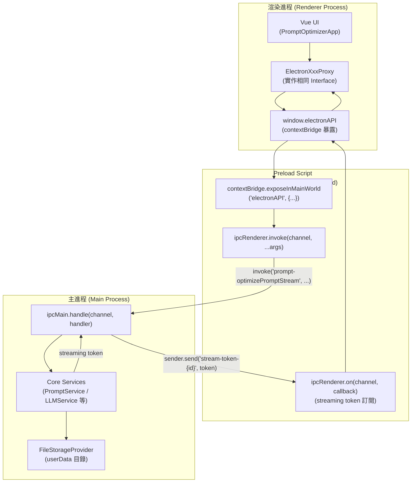
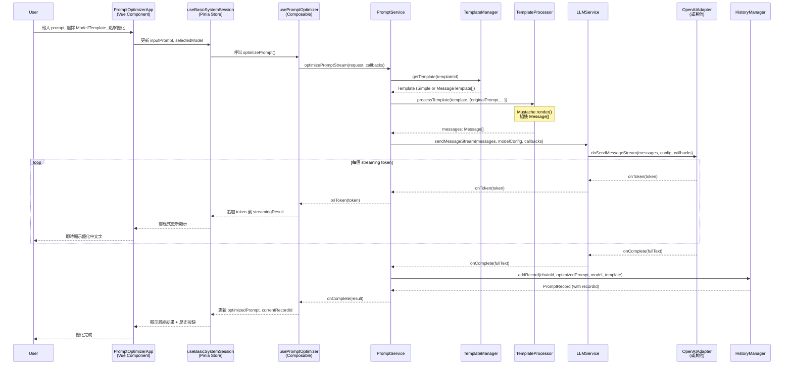
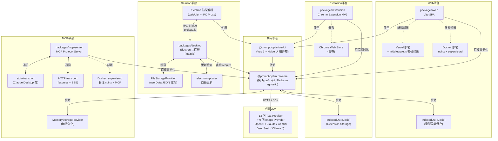

# Prompt Optimizer — 系統架構說明

> 版本：2.9.6 · 更新日期：2026-04-30（增量更新基於 commit `3824b64`） · 授權：AGPL-3.0-only

---

## 1. 高層架構概覽

本系統採用 **Monorepo + 分層解耦** 的設計，核心業務邏輯完全平台無關，可跨瀏覽器、Node.js、Electron 三種 Runtime 執行。使用者互動層與部署層互相獨立，透過明確的介面邊界組合。

```mermaid
graph LR
    subgraph 客戶端["客戶端 (Client Runtimes)"]
        WEB["Web SPA\n(Vite + Vue 3)"]
        EXT["Chrome Extension\n(Manifest V3)"]
        DESK["Electron Desktop\n(主進程 + 渲染進程)"]
    end

    subgraph 伺服器["伺服器端 / Headless"]
        MCP["MCP Server\n(stdio / HTTP)"]
    end

    subgraph UI層["@prompt-optimizer/ui"]
        COMP["Vue Components (~60個)"]
        STORES["Pinia Session Stores"]
        COMP_ABLES["Composables\n(usePromptOptimizer 等)"]
    end

    subgraph Core層["@prompt-optimizer/core (Platform-agnostic)"]
        PROMPT_SVC["PromptService\n(Orchestrator)"]
        LLM_SVC["LLMService\n+ AdapterRegistry"]
        TMPL["TemplateManager\n+ TemplateProcessor"]
        HIST["HistoryManager"]
        MODEL["ModelManager"]
        STORAGE["StorageAbstraction\n(IStorageProvider)"]
    end

    subgraph LLM_PROVIDERS["LLM Providers (外部)"]
        OPENAI["OpenAI / DeepSeek\n/ SiliconFlow 等"]
        ANTHROPIC["Anthropic Claude"]
        GEMINI["Google Gemini"]
        LOCAL["Ollama (本機)"]
    end

    WEB -->|mount PromptOptimizerApp| UI層
    EXT -->|mount PromptOptimizerApp| UI層
    DESK -->|渲染進程 load web/dist| UI層
    MCP -->|直接呼叫| Core層

    UI層 -->|Web/Extension: 直接實例化| Core層
    DESK -->|IPC Proxy 橋接| Core層

    STORAGE -->|IndexedDB / Dexie| WEB
    STORAGE -->|IndexedDB / Dexie| EXT
    STORAGE -->|FileSystem JSON| DESK
    STORAGE -->|Memory (測試)| MCP

    LLM_SVC --> OPENAI
    LLM_SVC --> ANTHROPIC
    LLM_SVC --> GEMINI
    LLM_SVC --> LOCAL
```

---

## 2. 元件清單

| 元件 | 職責 | 關鍵路徑 | 上游依賴 | 下游依賴 |
|------|------|----------|----------|----------|
| **packages/core** | 平台無關的業務邏輯核心 | `packages/core/src/` | — | Storage Provider, LLM Providers |
| **PromptService** | Orchestrator：協調模板渲染→LLM 呼叫→歷史儲存 | `services/prompt/service.ts` | LLMService, TemplateManager, HistoryManager, ModelManager | — |
| **LLMService** | 統一 LLM 呼叫介面，delegate 給 AdapterRegistry | `services/llm/service.ts` | TextAdapterRegistry | 各家 LLM API |
| **TextAdapterRegistry** | 維護 13 個 LLM adapter 的 Map，按 providerId 路由 | `services/llm/adapters/registry.ts` | AbstractTextProviderAdapter 子類 | LLM SDKs |
| **TemplateProcessor** | Mustache 渲染，將 Template + Context 組裝成 Message[] | `services/template/processor.ts` | Mustache library | PromptService |
| **TemplateManager** | 內建 + 自訂 Template 的 CRUD | `services/template/manager.ts` | IStorageProvider | PromptService |
| **HistoryManager** | 優化鏈 (Chain) 版本管理，最多保留 50 筆 | `services/history/manager.ts` | IStorageProvider, ModelManager | PromptService |
| **ModelManager** | 文字模型設定 CRUD，載入環境變數預設值 | `services/model/manager.ts` | IStorageProvider | LLMService, HistoryManager |
| **StorageFactory** | 依環境建立對應 IStorageProvider 實例 | `services/storage/factory.ts` | — | 所有需要持久化的服務 |
| **EvaluationService** | LLM-as-judge 評估：pair-judge → synthesis | `services/evaluation/service.ts` | LLMService, TemplateManager | UI 評估流程 |
| **packages/ui** | Vue 3 + Naive UI 組件庫，Web/Extension 共用 | `packages/ui/src/` | @prompt-optimizer/core | Web, Extension |
| **Pinia Session Stores** | 各功能模式的 UI 狀態（7 種 session store） | `ui/src/stores/session/` | AppServices (via getPiniaServices()) | Vue 組件 |
| **useAppInitializer** | 依環境判斷初始化真實服務或 IPC Proxy | `ui/src/composables/system/useAppInitializer.ts` | StorageFactory / window.electronAPI | 所有 Stores |
| **packages/web** | Vite SPA 殼層，純粹 mount PromptOptimizerApp | `packages/web/src/` | @prompt-optimizer/ui | 瀏覽器 |
| **packages/extension** | Chrome Extension 殼層，與 web 幾乎相同結構 | `packages/extension/src/` | @prompt-optimizer/ui | Chrome |
| **packages/desktop** | Electron 主進程 + Preload，宿主 core 服務 | `packages/desktop/main.js` | @prompt-optimizer/core | 渲染進程 (web/dist) |
| **packages/mcp-server** | MCP 協議伺服器，暴露 3 個工具給 AI agent | `packages/mcp-server/src/index.ts` | @prompt-optimizer/core | Claude Desktop 等 MCP clients |
| **api/auth.js** | Vercel Edge Function，密碼保護 middleware | `api/auth.js` | — | Vercel 部署 |

---

## 3. 分層設計與 Module Boundary

```
┌─────────────────────────────────────────────────────────────┐
│  Layer 4：部署殼層 (Shell)                                   │
│  packages/web · packages/extension · packages/desktop        │
│  packages/mcp-server · api/auth.js · docker/                 │
│  職責：平台適配、入口點、環境變數載入                         │
├─────────────────────────────────────────────────────────────┤
│  Layer 3：UI 層 (@prompt-optimizer/ui)                       │
│  Vue Components · Pinia Stores · Composables · i18n · Router │
│  職責：使用者互動、狀態管理、多語系                           │
│  邊界：只能透過 getPiniaServices() 取得 core 服務實例         │
├─────────────────────────────────────────────────────────────┤
│  Layer 2：核心業務層 (@prompt-optimizer/core)                │
│  PromptService · LLMService · TemplateManager · 所有 Services│
│  職責：業務邏輯、LLM 呼叫、資料管理                          │
│  邊界：不可 import 任何 Vue / DOM / Electron API              │
├─────────────────────────────────────────────────────────────┤
│  Layer 1：基礎設施層 (Infrastructure)                        │
│  IStorageProvider · LLM SDKs (openai / anthropic / google)   │
│  職責：I/O 抽象，可替換實作                                   │
└─────────────────────────────────────────────────────────────┘
```

**關鍵 Boundary 規則**：
- `packages/core` 不得依賴任何 `packages/ui` 的模組（單向依賴）
- `packages/ui` 透過 `setPiniaServices()` / `getPiniaServices()` 模組級單例取得服務，而非 Vue provide/inject
- Electron 渲染進程只能透過 `window.electronAPI` 存取主進程，不可直接 require Node.js 模組
- `StorageFactory.create('file')` 故意拋出錯誤，強制呼叫端直接 new `FileStorageProvider` 並傳入路徑參數

---

## 4. 通訊模式

| 通訊路徑 | 模式 | 說明 |
|----------|------|------|
| UI → PromptService (Web/Extension) | **Sync/Async** | 直接方法呼叫，TypeScript 介面 |
| UI → LLMService (streaming) | **Streaming (Callback)** | `sendMessageStream(messages, config, callbacks)` 傳入 `{onToken, onComplete, onError}` callbacks |
| Electron 渲染進程 → 主進程 | **Async IPC** | `ipcRenderer.invoke()` → `ipcMain.handle()`，Promise-based |
| Electron 主進程 → 渲染進程 (streaming) | **IPC Event** | 主進程用 `event.sender.send('stream-token-{streamId}', token)` 推送 token；Preload 訂閱後轉成 callback |
| MCP Client → MCP Server (stdio) | **JSON-RPC over stdio** | `@modelcontextprotocol/sdk` StdioServerTransport |
| MCP Client → MCP Server (HTTP) | **Streaming HTTP (SSE)** | `StreamableHTTPServerTransport` + express |
| LLMService → LLM Provider | **HTTPS (streaming)** | OpenAI SDK / Anthropic SDK / Google GenAI SDK / fetch；SSE stream |

---

## 5. Electron IPC 機制詳解

Electron 採用三層架構，以 `contextIsolation: true` 強制隔離：



**IPC Channel 命名慣例**：`{domain}-{method}`，例如：
- `prompt-optimizePromptStream`、`prompt-iteratePromptStream`
- `llm-sendMessageStream`、`llm-testConnection`
- `model-getModels`、`model-addModel`
- `template-getTemplates`、`data-exportAllData`

IPC channel 字串在 `packages/desktop/main.js` 與各 `electron-proxy.ts` 中**硬編碼**，兩側必須完全一致。

**Streaming IPC 機制**：呼叫端產生唯一 `streamId`（`stream_{timestamp}_{random}`），主進程在 stream 期間以 `event.sender.send('stream-token-{streamId}', token)` 逐 token 推送；Preload 以 `ipcRenderer.on` 訂閱並轉為 callback，結束後自動移除監聽器。

---

## 6. 關鍵設計決策與 Trade-off

### 決策 1：Core 層完全 Platform-agnostic
**決策**：`packages/core` 不依賴任何 DOM、Vue、Electron API。  
**優點**：可在 Web/Electron/Node.js/MCP 四種環境直接執行，測試不需要模擬 DOM。  
**Trade-off**：部分功能（如圖像剪貼簿）需在 UI 層處理，core 只接受已處理的 base64 資料。

### 決策 2：Electron 使用 IPC Proxy 而非直接 require
**決策**：渲染進程不直接呼叫 Node.js API，而是透過 IPC proxy 類模擬相同介面。  
**優點**：安全性（`contextIsolation`）、渲染進程崩潰不影響主進程資料完整性。  
**Trade-off**：145 個 IPC handler 需要維護，channel 名稱是脆弱的字串耦合。

### 決策 3：Storage 抽象層使用 Strategy Pattern
**決策**：`IStorageProvider` 介面統一所有儲存後端（localStorage / IndexedDB / FileSystem / Memory）。  
**優點**：上層服務不感知儲存細節，測試用 MemoryStorageProvider 可完全替代。  
**Trade-off**：統一介面是 key-value 字串層（JSON 序列化由 `StorageAdapter` 負責），無法利用各 DB 的進階查詢能力。

### 決策 4：Template 系統採 Mustache + Message Array
**決策**：Template 支援「Simple 字串」和「MessageTemplate[] 陣列」兩種格式，使用 Mustache 做變數替換。  
**優點**：非開發者可透過 UI 直接撰寫/修改 template，不需要了解程式碼。  
**Trade-off**：Mustache 邏輯能力有限（無 loop、複雜條件），複雜場景需依賴 `{{#helpers.toJson}}` helper。

### 決策 5：Pinia 模組級單例服務注入
**決策**：使用 `setPiniaServices()` / `getPiniaServices()` 全域 shallowRef 注入服務，而非 Vue provide/inject。  
**優點**：Pinia store 可在任意位置取得服務，不需要 setup 鏈。  
**Trade-off**：服務初始化前呼叫 `getPiniaServices()` 會返回 `null`，需要 null guard，測試時需手動 mock。

### 決策 6：MCP Server 實際提供 3 個工具（文件標注 2 個）
**⚠️ 文件落差**：README 描述「2 個工具」，但 `packages/mcp-server/src/index.ts` 實際宣告 `optimize-user-prompt`、`optimize-system-prompt`、`iterate-prompt` 共 3 個。

---

## 7. 核心優化流程 Sequence Diagram

以下展示 **Web 環境**下使用者觸發「System Prompt 優化（Streaming）」的完整流程：



---

## 8. 多平台架構圖



---

## 9. 功能模式與 Session Store 對應

> 路由實際定義位於 `packages/ui/src/router/index.ts`；2026-04-30 新增 `workspaceRoutes.ts` 收斂 workspace 路徑解析與預設 path 常數（`DEFAULT_WORKSPACE_PATH = '/basic/system'`）。

| 功能模式 | Session Store | 路由 | 說明 |
|----------|---------------|------|------|
| Basic / System | `useBasicSystemSession` | `/basic/system` | 優化 system prompt |
| Basic / User | `useBasicUserSession` | `/basic/user` | 優化 user prompt |
| Pro / Multi-message | `useProMultiMessageSession` | `/pro/multi` | 多輪對話模式 |
| Pro / Variable | `useProVariableSession` | `/pro/variable` | 批量變數替換 |
| Image / Text2Image | `useImageText2ImageSession` | `/image/text2image` | 文生圖優化 |
| Image / Image2Image | `useImageImage2ImageSession` | `/image/image2image` | 圖生圖優化 |
| Image / Multi-Image | `useImageMultiImageSession` | `/image/multiimage` | 多圖模式（修正：先前文件誤記為 `/image/multi`） |
| Favorites（routed page） | — | `/favorites` | 2026-04-30: 獨立路由的收藏管理頁，由 `components/favorites/FavoritesPage.vue` 載入 |

**Workspace ↔ Favorites 切換**：`components/app-layout/workspaceRouteSwitch.ts`（2026-04-30 新增）封裝 router push 與 session activate 的協同邏輯。

---

## 附錄：關鍵檔案速查

| 功能 | 檔案路徑 |
|------|----------|
| Electron 主進程 | `packages/desktop/main.js` |
| Electron Preload | `packages/desktop/preload.js` |
| 服務初始化（Web/Extension） | `packages/ui/src/composables/system/useAppInitializer.ts` |
| 服務注入（Pinia） | `packages/ui/src/plugins/pinia.ts` |
| Prompt 優化核心 | `packages/core/src/services/prompt/service.ts` |
| Template 渲染 | `packages/core/src/services/template/processor.ts` |
| LLM Adapter 抽象基類 | `packages/core/src/services/llm/adapters/abstract-adapter.ts` |
| LLM Adapter 註冊表 | `packages/core/src/services/llm/adapters/registry.ts` |
| Storage 介面定義 | `packages/core/src/services/storage/types.ts` |
| MCP Server 入口 | `packages/mcp-server/src/index.ts` |
| 內建 Template 目錄 | `packages/core/src/services/template/default-templates/` |
| Vercel 密碼保護 | `api/auth.js` · `middleware.js` |
