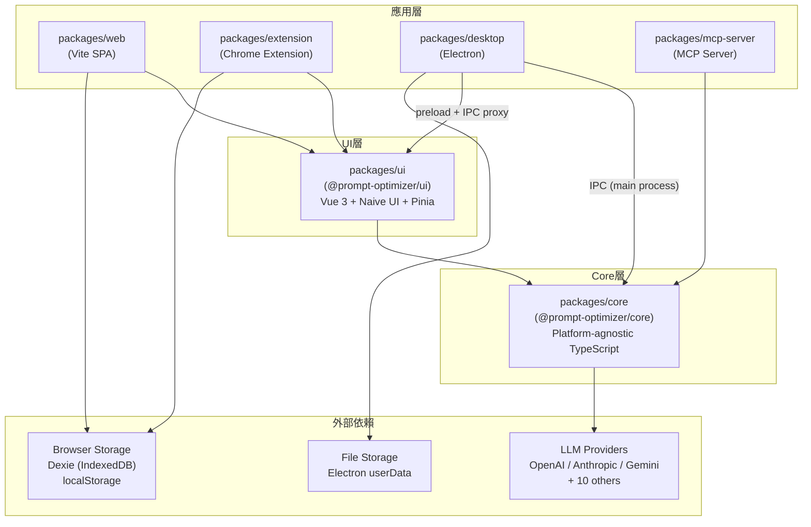
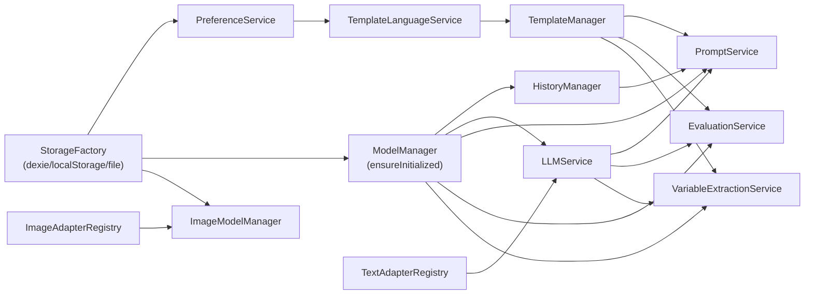

# Codebase Map — 程式碼地圖

## Annotated Directory Tree

```
prompt-optimizer/                    # Monorepo 根目錄 (pnpm workspace)
│
├── packages/                        # 所有可發布/可建置套件
│   ├── core/                        # ⭐ 核心邏輯，Platform-agnostic TypeScript
│   │   └── src/
│   │       ├── index.ts             # 公開 API 入口，所有 export 在此
│   │       ├── constants/           # 錯誤碼、儲存 key 常數
│   │       ├── interfaces/          # import/export 介面定義
│   │       ├── services/
│   │       │   ├── adapters/        # AbstractAdapterRegistry 抽象基類
│   │       │   ├── compare/         # 比較服務
│   │       │   ├── context/         # Context 模式 (system/user)，ContextRepo
│   │       │   ├── data/            # DataManager，import/export 全資料
│   │       │   ├── evaluation/      # EvaluationService，LLM-as-judge 評估
│   │       │   ├── favorite/        # FavoriteManager，收藏管理
│   │       │   ├── history/         # HistoryManager，版本鏈管理
│   │       │   ├── image/           # ImageService + 9 個圖像 adapters
│   │       │   ├── image-model/     # ImageModelManager
│   │       │   ├── image-understanding/ # 圖像理解服務（multimodal LLM）
│   │       │   ├── llm/             # ⭐ LLMService + 13 個文字 adapters
│   │       │   ├── model/           # ModelManager，模型設定管理
│   │       │   ├── preference/      # PreferenceService，使用者偏好
│   │       │   ├── prompt/          # ⭐ PromptService，核心業務協調器
│   │       │   ├── shared/          # 共用型別（BaseProvider 等）
│   │       │   ├── storage/         # 儲存抽象層（4種實作）
│   │       │   ├── template/        # TemplateManager + Processor + 內建模板
│   │       │   │                    # 2026-04-30: 新增 6 個 SOUL 模板（OpenClaw/Hermes 系統用）
│   │       │   │                    # default-templates/optimize/soul-{hermes,openclaw}-compose{,_en}.ts
│   │       │   │                    # default-templates/iterate/soul-iterate{,_en}.ts
│   │       │   ├── variable-extraction/      # 自動提取 prompt 變數
│   │       │   └── variable-value-generation/ # 生成測試變數值
│   │       ├── types/               # 全局型別
│   │       └── utils/               # 環境偵測、錯誤工具等
│   │
│   ├── ui/                          # Vue 3 UI Library（@prompt-optimizer/ui）
│   │   └── src/
│   │       ├── components/          # ~70 個 Vue 組件
│   │       │   ├── app-layout/      # PromptOptimizerApp.vue（主應用）, AppCoreNav, AppHeaderActions
│   │       │   │                    # 2026-04-30: + workspaceRouteSwitch.ts（路由與 session 切換 helper）
│   │       │   ├── basic-mode/      # Basic 模式 Workspace 組件
│   │       │   ├── context-mode/    # Pro 多輪對話 Workspace
│   │       │   ├── evaluation/      # 評估相關組件
│   │       │   ├── favorites/       # 2026-04-30: 新增 routed Favorites page
│   │       │   │                    # FavoritesPage.vue（獨立路由 /favorites）
│   │       │   │                    # favorites-page-context.ts
│   │       │   ├── image-mode/      # 圖像模式 Workspace
│   │       │   ├── variable/        # 變數管理組件
│   │       │   ├── variable-extraction/ # 變數提取組件
│   │       │   ├── common/          # 共用組件（含 2026-04-30 新增 WorkspaceUtilityMenu.vue）
│   │       │   ├── Favorite*.vue    # 多個 Favorite 拆解元件（Manager/EditorForm/DetailPanel/
│   │       │   │                    # ImportPanel/LibraryWorkspace/Reproducibility{Display,Editor}/
│   │       │   │                    # WorkspaceListItem，2026-04-30 大改造）
│   │       │   └── ...              # 其他共用組件
│   │       ├── composables/         # Vue Composition API hooks（業務邏輯）
│   │       │   ├── app/             # useAppFavorite, useAppHistoryRestore, useAppPromptGardenImport
│   │       │   ├── prompt/          # usePromptOptimizer（核心優化邏輯）, useContextUserOptimization
│   │       │   ├── session/         # session 相關 composables
│   │       │   ├── system/          # useAppInitializer（服務初始化）
│   │       │   ├── ui/              # useToast 等 UI 工具
│   │       │   └── workspaces/      # 2026-04-30: useBasicWorkspaceLogic 等
│   │       ├── stores/              # Pinia stores
│   │       │   └── session/         # 每個功能模式的 session store
│   │       ├── utils/               # 2026-04-30: + favorite-mode.ts, favorite-reproducibility.ts,
│   │       │                        # external-data-loading.ts
│   │       ├── i18n/locales/        # 多語言 (zh-CN, zh-TW, en-US)
│   │       ├── plugins/             # pinia.ts, i18n.ts（服務注入點）
│   │       ├── router/              # Vue Router 路由配置
│   │       │                        # 2026-04-30: + workspaceRoutes.ts（routing helpers + DEFAULT_WORKSPACE_PATH）
│   │       └── config/              # Naive UI 主題設定
│   │
│   ├── web/                         # Vite SPA（Web App 部署目標）
│   │   └── src/
│   │       ├── main.ts              # 入口：安裝插件、掛載 App
│   │       └── App.vue              # 純殼，渲染 PromptOptimizerApp
│   │
│   ├── extension/                   # Chrome Extension 部署目標
│   │   └── src/
│   │       ├── main.ts              # 入口（與 web 結構相同）
│   │       └── App.vue              # Extension UI 殼
│   │
│   ├── desktop/                     # Electron Desktop 應用
│   │   ├── main.js                  # ⭐ 主進程：建立 Window、IPC handlers、core 服務
│   │   ├── preload.js               # Preload script：contextBridge 暴露 electronAPI
│   │   └── config/
│   │       ├── proxy-dispatcher.js  # 系統代理設定（Electron）
│   │       └── update-config.js     # 自動更新設定
│   │
│   └── mcp-server/                  # MCP Protocol Server（Node.js）
│       └── src/
│           ├── index.ts             # ⭐ 伺服器入口，工具定義與 handlers
│           ├── start.ts             # 啟動邏輯
│           └── adapters/            # CoreServicesManager（初始化 core 服務）
│
├── api/
│   └── auth.js                      # Vercel Edge Function，HTTP Basic Auth 保護
│
├── docker/                          # Docker 相關腳本
│   ├── nginx.conf                   # Nginx 設定（靜態資源 + /mcp 反代）
│   ├── generate-config.sh           # 從環境變數生成 runtime_config
│   ├── generate-auth.sh             # 生成 nginx htpasswd 檔
│   └── supervisord.conf             # supervisord 管理 nginx + MCP server
│
├── docs/                            # 使用者文件（image-mode.md 等）
├── mkdocs/                          # MkDocs 文件站設定
├── releases/                        # 各版本發布說明（中英雙語）
├── scripts/                         # 建置/測試/版本管理腳本
│   ├── run-many.js                  # 串行/並行執行多個 npm scripts
│   ├── sync-versions.js             # 同步所有 package 版本號
│   ├── check-locale-parity.mjs      # 驗證多語言 key 完整性
│   └── check-no-chinese-runtime.mjs # 確保 runtime 無中文硬編碼
│
├── tests/e2e/                       # Playwright E2E 測試
├── Dockerfile                       # 多階段 Docker 建置
├── docker-compose.yml               # Docker Compose（production）
├── docker-compose.dev.yml           # Docker Compose（dev）
├── middleware.js                    # Vercel middleware（密碼保護）
├── vercel.json                      # Vercel 部署設定
├── env.local.example                # 環境變數範例
├── pnpm-workspace.yaml              # pnpm workspace 設定
└── package.json                     # Root，協調所有建置腳本
```

---

## 「我想改 X 要看哪裡？」速查表

| 我想要... | 看這裡 | 關鍵檔案 |
|-----------|--------|----------|
| 新增一個 LLM Provider | `packages/core/src/services/llm/adapters/` | 新增 `xxx-adapter.ts`，修改 `registry.ts:52` |
| 新增一個內建 Prompt 優化模板 | `packages/core/src/services/template/default-templates/` | 對應子目錄的 `content.ts` + `builders.ts` |
| 修改優化核心邏輯 | `packages/core/src/services/prompt/` | `service.ts`, `factory.ts` |
| 修改 Template 渲染邏輯 | `packages/core/src/services/template/` | `processor.ts` |
| 修改 UI 主介面佈局 | `packages/ui/src/components/app-layout/` | `PromptOptimizerApp.vue`, `MainLayout.vue` |
| 新增功能模式（如新 Workspace） | `packages/ui/src/components/` + `stores/session/` + `router/` | 新增 Workspace 組件 + session store + 路由 |
| 修改 Favorites 收藏管理 UI | `packages/ui/src/components/favorites/` + `Favorite*.vue` | `FavoritesPage.vue` 路由頁；`FavoriteManager`/`FavoriteLibraryWorkspace` 等元件（2026-04-30 拆解） |
| 加入新的 SOUL / 結構化人格模板 | `packages/core/src/services/template/default-templates/` | `optimize/soul-{name}-compose.ts`（中英版）+ 註冊到 `default-templates/index.ts` |
| 修改歷史記錄 | `packages/core/src/services/history/` | `manager.ts`, `types.ts` |
| 修改資料匯入/匯出 | `packages/core/src/services/data/` | `manager.ts` |
| 修改評估邏輯 | `packages/core/src/services/evaluation/` | `service.ts`, `types.ts` |
| 修改圖像生成 | `packages/core/src/services/image/` | `service.ts`, `adapters/` |
| 修改 Electron 主進程 | `packages/desktop/` | `main.js` |
| 新增 Electron IPC 通道 | `packages/desktop/main.js` (ipcMain) + `preload.js` (bridge) + 對應 proxy | 需同時修改三處 |
| 修改 MCP 工具 | `packages/mcp-server/src/index.ts` | `setupServerHandlers()` |
| 修改儲存策略 | `packages/core/src/services/storage/` | 對應的 Provider `*.ts` |
| 新增環境變數 | `env.local.example` + `packages/core/src/services/model/defaults.ts` | `PROVIDER_ENV_KEYS` |
| 新增自定義模型 | `.env.local` 設定 `VITE_CUSTOM_API_*_suffix` | `environment.ts:scanCustomModelEnvVars()` |
| 修改 Docker nginx 設定 | `docker/nginx.conf` | |
| 修改 Docker 啟動腳本 | `docker/start-services.sh` | |
| 修改 Vercel 設定 | `vercel.json`, `middleware.js` | |
| 新增 i18n 翻譯 | `packages/ui/src/i18n/locales/` | `zh-CN/`, `zh-TW/`, `en-US/` 各加一份 |
| 修改主題/樣式 | `packages/ui/src/config/naive-theme.ts` | `packages/ui/src/styles/` |

---

## 模組依賴關係圖



---

## 核心服務初始化依賴順序



---

## 重要規則與約定

1. **core 層不引用 UI 層** — 嚴格單向依賴
2. **template ID 命名** — kebab-case，如 `general-optimize`、`context-message-optimize`
3. **環境變數命名** — LLM 相關使用 `VITE_` 前綴（Vite build-time 替換），其他使用無前綴
4. **electron proxy 命名** — `Electron{ServiceName}Proxy`，實作與真實服務完全相同的 interface
5. **storage key 命名** — 定義在 `packages/core/src/constants/storage-keys.ts`，不可散落在各處
6. **component 命名** — `packages/ui` 導出的組件加 `UI` 後綴（如 `ModelManagerUI`），避免衝突
7. **版本同步** — 修改版本號用 `pnpm version:sync`，確保所有 package.json 同步
