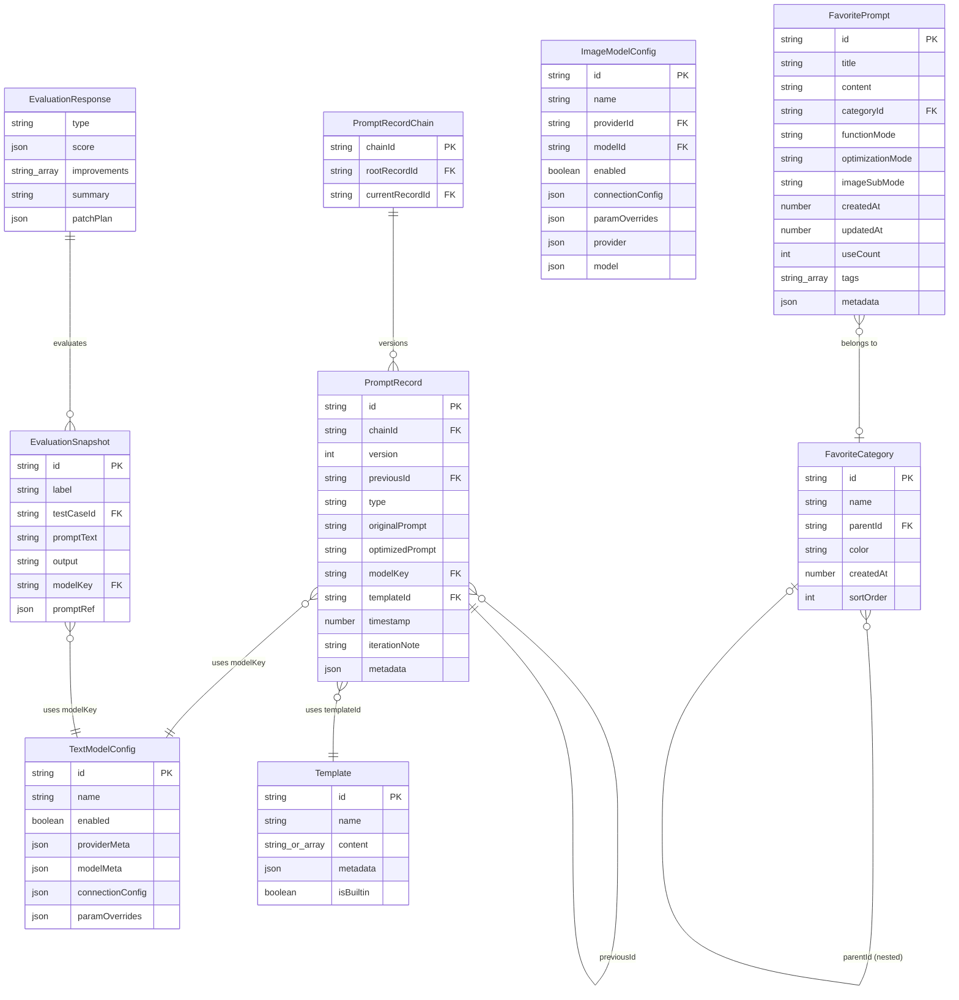

# 資料模型詳細說明

> 版本：2.9.4 ｜ 產出日期：2026-04-23  
> 原始碼基準路徑：`packages/core/src/services/`

---

## 1. 核心 Entity 清單

| Entity | 主要檔案 | 說明 |
|--------|----------|------|
| `PromptRecord` | `history/types.ts:24` | 單次優化／迭代的結果記錄 |
| `PromptRecordChain` | `history/types.ts:73` | 同一優化任務的版本鏈 |
| `Template` | `template/types.ts:49` | 優化用的 prompt 模板 |
| `TemplateMetadata` | `template/types.ts:9` | 模板分類與版本元資料 |
| `MessageTemplate` | `template/types.ts:38` | Advanced 格式的單條訊息 |
| `TextModelConfig` | `model/types.ts:43` | 文字模型使用者設定 |
| `StoredTextModelConfig` | `model/types.ts:66` | 持久化用的文字模型設定 |
| `ImageModelConfig` | `image/types.ts:42` | 圖像模型使用者設定 |
| `ImageModel` | `image/types.ts:27` | 圖像模型靜態定義 |
| `ImageProvider` | `image/types.ts:22` | 圖像服務提供商定義 |
| `TextProvider` | `model/types.ts:14` | 文字服務提供商定義 |
| `BaseProvider` | `shared/types.ts:23` | Provider 共同屬性基底 |
| `FavoritePrompt` | `favorite/types.ts:4` | 收藏的 prompt 項目 |
| `FavoriteCategory` | `favorite/types.ts:60` | 收藏分類 |
| `FavoriteTag` | `favorite/types.ts:101` | 獨立標籤 |
| `EvaluationRequest` | `evaluation/types.ts:428` | 評估請求聯合型別 |
| `EvaluationResponse` | `evaluation/types.ts:461` | 評估結果與分數 |
| `EvaluationScore` | `evaluation/types.ts:451` | 評估總分與維度分數 |
| `EvaluationSnapshot` | `evaluation/types.ts:183` | 單次執行快照 |
| `StorageRecord` | `storage/dexieStorageProvider.ts:8` | Dexie 底層儲存記錄 |

### PromptRecord 欄位

| 欄位 | 型別 | 說明 |
|------|------|------|
| `id` | `string` (UUID) | 唯一識別碼 |
| `chainId` | `string` (UUID) | 所屬版本鏈 ID |
| `version` | `number` | 鏈內版本號（1-based） |
| `previousId?` | `string` | 前一版本 ID，形成鏈結 |
| `type` | `PromptRecordType` | 13 種類型，見下方 |
| `originalPrompt` | `string` | 優化前的原始 prompt |
| `optimizedPrompt` | `string` | 優化後結果 |
| `modelKey` | `string` | 使用的模型 key |
| `modelName?` | `string` | 模型顯示名稱（UI 用） |
| `templateId` | `string` | 使用的模板 ID |
| `iterationNote?` | `string` | 迭代說明 |
| `timestamp` | `number` | Unix timestamp (ms) |
| `metadata?` | `object` | 擴展元資料（含 conversationSnapshot） |

**PromptRecordType 枚舉（共 13 種）**：  
`optimize` | `userOptimize` | `iterate` | `test` | `contextUserOptimize` | `contextIterate` | `imageOptimize` | `contextImageOptimize` | `imageIterate` | `text2imageOptimize` | `image2imageOptimize` | `multiimageOptimize` | `conversationMessageOptimize`

---

## 2. ER Diagram



---

## 3. Storage 策略摘要

| 環境 | Provider 類別 | 實作位置 | 特點 |
|------|--------------|----------|------|
| 瀏覽器（Web / Extension） | `DexieStorageProvider` | `storage/dexieStorageProvider.ts` | IndexedDB，容量可達數 GB，原子事務 |
| 瀏覽器 fallback | `LocalStorageProvider` | `storage/localStorageProvider.ts` | 同步 API，5 MB 上限 |
| Electron (Desktop) | `FileStorageProvider` | `storage/fileStorageProvider.ts` | Node.js fs，JSON 檔案存於 `userData` |
| 測試 / SSR | `MemoryStorageProvider` | `storage/memoryStorageProvider.ts` | `Map<string, string>`，不持久化 |

### IStorageProvider 介面（`storage/types.ts:1`）

```typescript
interface IStorageProvider {
  getItem(key: string): Promise<string | null>
  setItem(key: string, value: string): Promise<void>
  removeItem(key: string): Promise<void>
  clearAll(): Promise<void>
  updateData<T>(key: string, modifier: (current: T | null) => T): Promise<void>
  batchUpdate(operations: Array<{ key, operation, value? }>): Promise<void>
  getCapabilities?(): { supportsAtomic, supportsBatch, maxStorageSize? }
}
```

### Dexie Schema（`dexieStorageProvider.ts:44`）

```
資料庫名稱：PromptOptimizerDB（測試時注入 window.__TEST_DB_NAME__）
版本：1

table: storage
  key        string  (Primary Key)
  value      string  (JSON 序列化後的完整物件)
  timestamp? number  (最後寫入時間，用於排序與淘汰)
```

所有業務資料（歷史、模板、模型設定、收藏等）都以 **JSON 字串**形式整體序列化後存入 `value` 欄位，key 為各服務定義的常數（`constants/` 目錄）。

`DexieStorageProvider` 的原子更新流程：
1. 嘗試 Dexie transaction (`rw` 模式) 執行 read-modify-write
2. 若 `PrematureCommitError`，指數退避最多重試 3 次
3. 全部失敗後降級為簡單 read-write（無 transaction）

---

## 4. Template 資料結構

Template 的 `content` 欄位支援兩種格式（`template/types.ts:52`）：

### Simple 格式（`content: string`）

```
純文字 system prompt，TemplateProcessor 自動組裝為：
  [{ role: 'system', content: <template string> },
   { role: 'user',   content: <originalPrompt> }]
```

適用情境：簡單優化，不需要特殊變數替換。

### Advanced 格式（`content: MessageTemplate[]`）

```typescript
interface MessageTemplate {
  role: 'system' | 'user' | 'assistant' | 'tool'
  content: string          // 支援 Mustache 變數：{{originalPrompt}} 等
  name?: string
  tool_calls?: ToolCall[]
  tool_call_id?: string
}
```

適用情境：迭代優化（必須使用此格式）、多輪對話、Function Calling 場景。

### 對比摘要

| 面向 | Simple | Advanced |
|------|--------|----------|
| 格式 | `string` | `MessageTemplate[]` |
| Mustache 變數 | 不支援 | 完整支援 |
| 訊息結構控制 | 自動 2 條 | 完全自訂 |
| 迭代優化支援 | 否（強制 Advanced） | 是 |
| 內建模板數量 | 少數舊版 | 多數現行版本 |

### TemplateMetadata.templateType（16 種）

`optimize` | `userOptimize` | `text2imageOptimize` | `image2imageOptimize` | `multiimageOptimize` | `imageIterate` | `iterate` | `conversationMessageOptimize` | `contextUserOptimize` | `contextIterate` | `contextSystemOptimize` | `evaluation` | `variable-extraction` | `variable-value-generation` | `image-prompt-composition` | `image-prompt-migration`

---

## 5. HistoryChain 版本鏈模型

### 資料結構（`history/types.ts:73`）

```typescript
interface PromptRecordChain {
  chainId: string          // 版本鏈唯一 ID
  rootRecord: PromptRecord // 第一版（原始優化）
  currentRecord: PromptRecord // 最新版本
  versions: PromptRecord[] // 所有版本（含 root）
}
```

### 版本鏈示意

```
Chain (chainId = "abc-123")
  ├── PromptRecord { version:1, type:'optimize',  previousId: undefined }  ← rootRecord
  ├── PromptRecord { version:2, type:'iterate',   previousId: v1.id }
  └── PromptRecord { version:3, type:'iterate',   previousId: v2.id }  ← currentRecord
```

### 管理規則（`history/manager.ts`）

- 新建優化 → 呼叫 `createNewChain()`，產生新 chainId，version = 1
- 迭代 → 呼叫 `addIteration()`，在同一 chainId 下追加，version 遞增
- **最大保留 50 條 chain**，超過自動刪除最舊的（`manager.ts:17`）
- `getIterationChain(recordId)` 可從任意版本往上追溯整條鏈

### `previousId` 鏈結用途

- 追溯：任意版本 → 逐步 `.previousId` 回到 root
- 刪除單一版本時維持鏈完整性
- 版本間 diff 顯示（使用 `diff` 套件）

---

## 6. Model Config 結構

### TextModelConfig（`model/types.ts:43`）

| 欄位 | 型別 | 說明 |
|------|------|------|
| `id` | `string` | 使用者設定的唯一 key |
| `name` | `string` | 顯示名稱 |
| `enabled` | `boolean` | 是否啟用 |
| `providerMeta` | `TextProvider` | Provider 靜態定義快照 |
| `modelMeta` | `TextModel` | 模型靜態定義快照（含 capabilities） |
| `connectionConfig` | `{ apiKey?, baseURL?, ...}` | 連線憑證 |
| `paramOverrides?` | `Record<string, unknown>` | 參數覆蓋（temperature 等） |
| `customParamOverrides?` | `Record<string, unknown>` | **@deprecated**，見第 8 節 |

**TextModel.capabilities** 欄位：

| 欄位 | 說明 |
|------|------|
| `supportsTools` | 是否支援 Function Calling |
| `supportsReasoning?` | 是否支援推理 token（如 o1） |
| `maxContextLength?` | 最大 context 長度 |

### ImageModelConfig（`image/types.ts:42`）

| 欄位 | 型別 | 說明 |
|------|------|------|
| `id` | `string` | 設定唯一 ID |
| `name` | `string` | 顯示名稱 |
| `providerId` | `string` | 引用 Provider ID |
| `modelId` | `string` | 引用 Model ID |
| `enabled` | `boolean` | 是否啟用 |
| `connectionConfig?` | `{ apiKey?, baseURL?, ...}` | 連線憑證 |
| `paramOverrides?` | `Record<string, unknown>` | 統一參數覆蓋 |
| `customParamOverrides?` | `Record<string, unknown>` | **@deprecated**，見第 8 節 |
| `provider` | `ImageProvider` | Provider 資料完整副本（自包含） |
| `model` | `ImageModel` | Model 資料完整副本（自包含） |

**ImageModel.capabilities** 欄位：

| 欄位 | 說明 |
|------|------|
| `text2image` | 支援文生圖 |
| `image2image` | 支援圖生圖 |
| `multiImage?` | 支援多圖輸入 |

> 注意：`ImageModelConfig` 與 `TextModelConfig` 設計略有差異。Image 版本採**自包含設計**，直接內嵌 `provider` 與 `model` 完整物件；Text 版本則稱為 `providerMeta` / `modelMeta`，語意相同。

---

## 7. 資料生命週期（以 PromptHistory 為例）

```
1. 建立
   使用者點擊「優化」→ UI composable 組裝 OptimizationRequest
   → PromptService.optimizePromptStream() 取得 LLM 回應

2. 轉換（onComplete callback）
   UI composable 組裝 PromptRecord 物件：
   { id: uuidv4(), originalPrompt, optimizedPrompt,
     type: 'optimize', modelKey, templateId, timestamp: Date.now() }

3. 儲存
   → historyManager.createNewChain(record)
     → StorageAdapter.updateData(HISTORY_STORAGE_KEY, updater)
       → DexieStorageProvider.atomicUpdate()
         → Dexie transaction 寫入 JSON 字串到 table `storage`

4. 讀取
   → historyManager.getAllChains()
     → DexieStorageProvider.getItem(HISTORY_STORAGE_KEY)
       → JSON.parse() → PromptRecordChain[]
   UI 依 chainId 分組顯示版本列表

5. 迭代
   → historyManager.addIteration({ chainId, ... })
     → 在同一 chainId 下追加新 PromptRecord，version++

6. 淘汰
   當 chain 總數超過 50 條（manager.ts:17）：
   → 自動刪除最舊的 chain（按 rootRecord.timestamp 排序）
   或使用者手動呼叫 deleteChain(chainId) / clearHistory()
```

---

## 8. 已知 @deprecated 欄位

### `customParamOverrides`

| 項目 | 說明 |
|------|------|
| 影響的 Entity | `TextModelConfig`（`model/types.ts:60`）、`ImageModelConfig`（`image/types.ts:63`）、`StoredTextModelConfig`（`model/types.ts:79`） |
| 廢棄版本 | 標注「將在 v3.0 移除」 |
| 替換欄位 | `paramOverrides`（統一的參數覆蓋欄位） |
| 保留原因 | 向後相容：舊資料讀取時仍可解析此欄位，新資料寫入改用 `paramOverrides` |
| 遷移行為 | 讀取舊資料時，程式碼自動將 `customParamOverrides` 合併到 `paramOverrides`（⚠️ 具體合併邏輯需確認） |

### 舊版 `ModelConfig`（`model/types.ts:84`）

`ModelConfig` 介面保留了前代架構的扁平化設定結構（`provider`, `baseURL`, `defaultModel`, `llmParams` 等），現行架構改用 `TextModelConfig` 三層分離設計。僅用於解析舊版匯入資料。

---

## 附錄：Storage Key 命名規則

各服務以常數定義 storage key（`packages/core/src/constants/`），所有資料序列化為 JSON 後以單一 key 存入 `DexieStorageProvider`。例如：

| 資料 | Storage Key（⚠️ 以實際常數為準） |
|------|----------------------------------|
| 歷史記錄 | `prompt_history` 類 |
| 模型設定 | `model_configs` 類 |
| 模板 | `templates` 類 |
| 收藏 | `favorites` 類 |
| 偏好設定 | `preferences` 類 |

> ⚠️ 未驗證：確切的 key 名稱請參閱 `packages/core/src/constants/` 目錄下的原始碼。
