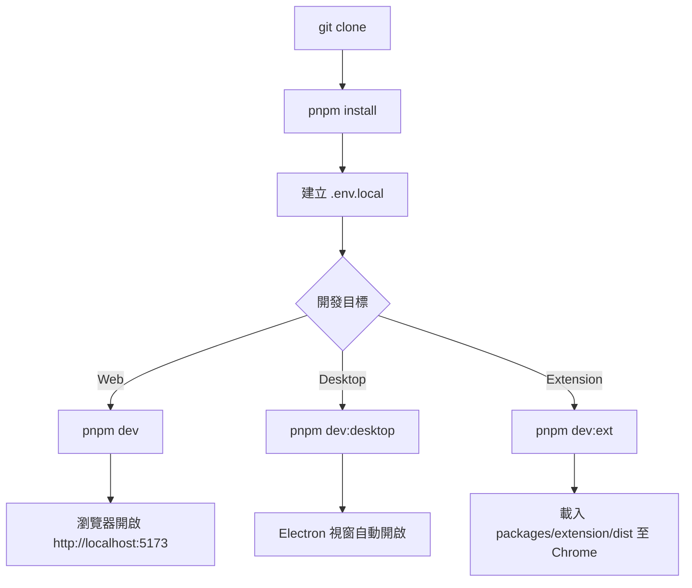
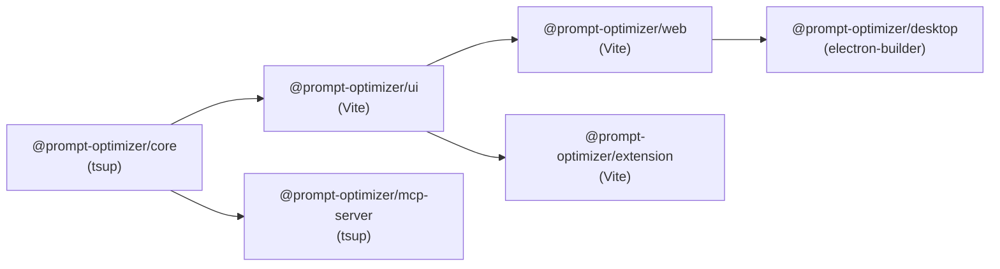

# Prompt Optimizer — 開發者上手指南

> 版本：2.9.4 | 授權：AGPL-3.0-only | 更新：2026-04-23

---

## 目錄

1. [Prerequisites 與環境建置](#1-prerequisites-與環境建置)
2. [本地開發 Workflow](#2-本地開發-workflow)
3. [專案建置說明](#3-專案建置說明)
4. [測試策略與執行方式](#4-測試策略與執行方式)
5. [Debugging 技巧](#5-debugging-技巧)
6. [常見踩坑](#6-常見踩坑)
7. [Contribution Workflow](#7-contribution-workflow)
8. [Docker 本地測試](#8-docker-本地測試)

---

## 1. Prerequisites 與環境建置

### 強制需求

| 工具 | 版本 | 說明 |
|------|------|------|
| **Node.js** | `^22.0.0`（強制）| `package.json` `engines` 欄位限制，不滿足會阻擋安裝 |
| **pnpm** | `10.6.1`（強制）| `packageManager` 欄位指定；npm/yarn 被 `engines` 欄位及 pre-commit hook 禁止 |
| **Git** | `>= 2.0` | 版本管理及 Husky hook |

> 來源：`/home/user/prompt-optimizer/package.json`

### 安裝 pnpm

```bash
# 推薦：使用 corepack（Node.js 22 內建）
corepack enable
corepack prepare pnpm@10.6.1 --activate
```

### 建議工具

- **VSCode**：專案推薦的編輯器
- **Docker >= 20.10.0**：執行容器化本地測試時需要
- **Playwright browsers**：首次執行 E2E 測試前需安裝（見第 4 節）

---

## 2. 本地開發 Workflow

### 完整流程圖



### Step-by-step

#### Step 1：Clone 與安裝依賴

```bash
git clone https://github.com/linshenkx/prompt-optimizer.git
cd prompt-optimizer
pnpm install
```

#### Step 2：設定 .env.local

複製範例檔並填入至少一個 API 金鑰：

```bash
cp env.local.example .env.local
```

最小可用設定（以 Gemini 為例）：

```env
# /home/user/prompt-optimizer/.env.local
VITE_GEMINI_API_KEY=your-gemini-api-key-here
```

其他可用的金鑰前綴（擇一即可啟動）：`VITE_OPENAI_API_KEY`、`VITE_DEEPSEEK_API_KEY`、`VITE_ANTHROPIC_API_KEY` 等。

> 完整列表見 `/home/user/prompt-optimizer/env.local.example`

#### Step 3a：Web 開發模式

```bash
pnpm dev
# 自動執行：clean:dist → build:core → build:ui → ui watch + web dev server
# 瀏覽器訪問 http://localhost:5173
```

`pnpm dev` 實際執行（來源：`package.json` `scripts.dev`）：
1. `clean:dist` — 清除所有 `dist/` 目錄
2. `build:core` — 用 tsup 建置 `@prompt-optimizer/core`
3. `build:ui` — 用 Vite 建置 `@prompt-optimizer/ui`
4. `dev:parallel` — 同時啟動：`ui build --watch` + `web dev server`

#### Step 3b：Desktop 開發模式

```bash
pnpm dev:desktop
# 自動執行：clean:dist → build:core → build:ui → web dev server + Electron
```

`pnpm dev:desktop` 同時啟動 web dev server 與 Electron，Electron 載入 web 的開發伺服器 URL。DevTools 在 `NODE_ENV=development` 時**自動開啟**（`main.js:453`）。

#### Step 3c：Extension 開發模式

```bash
pnpm dev:ext
# 輸出至 packages/extension/dist/
```

然後在 Chrome 前往 `chrome://extensions/` → 「載入已解壓縮的擴充功能」→ 選擇 `packages/extension/dist/`。

---

## 3. 專案建置說明

### 建置順序（依賴關係）



> web 和 extension 可並行建置；desktop 依賴 web 的產物。

### 關鍵 npm scripts

| Script | 說明 |
|--------|------|
| `pnpm build` | 建置所有套件（core → ui → web + ext 並行）|
| `pnpm build:core` | 只建置 core（`packages/core`，tsup）|
| `pnpm build:ui` | 只建置 UI 組件庫（`packages/ui`，Vite）|
| `pnpm build:web` | 只建置 Web SPA（`packages/web`，Vite）|
| `pnpm build:ext` | 只建置 Chrome Extension（`packages/extension`，Vite）|
| `pnpm build:desktop` | 完整 Desktop 建置：core → ui → web → electron-builder |
| `pnpm clean` | 清除所有 `dist/` 及 Vite 快取 |
| `pnpm dev:fresh` | 完全重置 Web 開發環境（kill + clean + install + dev）|
| `pnpm dev:desktop:fresh` | 完全重置 Desktop 開發環境 |
| `pnpm mcp:dev` | 啟動 MCP Server 開發模式 |
| `pnpm lint` | 執行 ESLint + TypeScript type check（所有套件）|
| `pnpm lint:fix` | 自動修復 ESLint 問題（僅 UI 套件）|

> 建置管線由 `scripts/run-many.js` 協調，支援循序（預設）與並行（`--parallel`）模式。

---

## 4. 測試策略與執行方式

### 測試架構總覽

```
tests/
├── e2e/               # Playwright E2E 測試
│   ├── gate/          # P0 冒煙測試（pre-commit gate）
│   ├── extended/      # 完整功能測試套件
│   ├── fixtures/      # VCR LLM response fixtures
│   └── helpers/       # 共用輔助工具（含 vcr.ts）
packages/
├── core/tests/        # Vitest 單元 & 整合測試
└── ui/tests/          # Vitest 組件測試
```

### 4.1 Unit Tests（Vitest）

```bash
pnpm test                                    # 所有套件
pnpm -F @prompt-optimizer/core test          # 只跑 core
pnpm -F @prompt-optimizer/ui test            # 只跑 ui
pnpm -F @prompt-optimizer/core test:coverage # 含 coverage 報告
```

測試檔命名規則：`*.test.ts`，位於各套件的 `tests/unit/` 或 `tests/integration/`。

### 4.2 E2E Tests（Playwright）

首次設定（安裝瀏覽器）：`pnpm exec playwright install chromium`

```bash
pnpm test:e2e          # 所有 E2E（真實 API）
pnpm test:e2e:gate     # P0 冒煙群組
pnpm test:e2e:extended # 完整功能群組
pnpm test:e2e:ui       # 互動式 UI 模式
pnpm test:e2e:debug    # Debug 逐步執行模式
```

E2E 群組定義於 `scripts/e2e-groups.js`：
- **gate**（P0）：路由 smoke、root bootstrap、basic user 優化、text2image 生成
- **extended**：analysis、optimize、session-persistence 等完整流程

### 4.3 Gate Tests（pre-commit）

每次 `git commit` 時 Husky 自動執行 `pnpm test:gate`，包含：

```
test:repo     → check:locale + check:no-chinese-runtime + script tests
test:gate:core → pnpm -F core test:gate
test:gate:ui   → build:core + pnpm -F ui test
```

> 緊急情況可用 `SKIP_TEST_GATE=1 git commit` 跳過，但應避免。來源：`.husky/pre-commit`

### 4.4 真實 API 整合測試

預設 core 整合測試**跳過**真實 API 呼叫。啟用方式：

```bash
# 1. 在 .env.local 設定 API 金鑰（如 VITE_OPENAI_API_KEY）
# 2. 設定環境變數並執行
RUN_REAL_API=1 pnpm -F @prompt-optimizer/core test

# 阿里百炼 Responses API 需額外旗標
RUN_REAL_API=1 RUN_DASHSCOPE_RESPONSES_REAL_API=1 pnpm -F @prompt-optimizer/core test
```

相關測試檔：
- `packages/core/tests/integration/real-api.test.ts`
- `packages/core/tests/integration/llm-service.spec.ts`
- `packages/core/tests/integration/llm/deepseek-live.integration.test.ts`（2026-04-30 新增，DeepSeek v4 模型實機驗證）

<!-- 以下段落更新於 2026-04-30, commit range: a9cbcd4..3824b64 -->
**新增的測試（2026-04-30）**：
- E2E：`tests/e2e/session-persistence/workspace-clear-content.spec.ts`（驗證 workspace clear content 工具與 Prompt Garden import 前清空流程）
- Core 單元：`packages/core/tests/unit/llm/deepseek-adapter.test.ts`、`packages/core/tests/unit/template/soul-template-registration.test.ts`
- UI 單元：`packages/ui/tests/unit/components/FavoritesPage.spec.ts` 等 11 個 favorites/route 相關 spec
- 手動驗收：`packages/core/tests/unit/template/soul-template-manual-acceptance.md`（SOUL 模板的人工驗收清單）
<!-- 更新結束 -->

---

## 5. Debugging 技巧

### 5.1 Web 應用 Debugging

使用瀏覽器 DevTools（F12）；搭配 Vue DevTools 插件可檢查 Pinia store 狀態與 component tree。

### 5.2 Electron 主進程 vs 渲染進程

| 進程 | DevTools | 說明 |
|------|----------|------|
| **渲染進程** | 自動開啟 Chromium DevTools | `NODE_ENV=development` 時（`main.js:453`）|
| **主進程** | VS Code 偵錯器 / `node --inspect` | 需手動掛載 |

已打包應用中開啟 DevTools：`Ctrl+Shift+I`（Win/Linux）或 `Cmd+Option+I`（macOS）。

### 5.3 追蹤 IPC 通訊

IPC 資料流：`渲染進程 → window.electronAPI（preload.js）→ ipcMain.handle（main.js）`

常用 channel：`preference-*`、`model-*`、`prompt-*`、`llm-*`

在主進程加 log：
```js
ipcMain.handle('llm-sendMessage', async (event, messages, provider) => {
  console.log('[IPC] llm-sendMessage, provider:', provider)
  // ...
})
```

在渲染進程 Console 直接測試：`window.electronAPI.getModels()`

### 5.4 Mock LLM 服務（VCR 模式）

E2E 測試使用 VCR 模式攔截 LLM API 呼叫，避免真實請求：

```bash
# 錄製模式：對指定測試建立 fixture（需要真實 API Key）
pnpm test:e2e:record -- tests/e2e/optimize/basic-user.spec.ts

# 回放模式：使用已錄製的 fixture（快速，無需 API）
E2E_VCR_MODE=replay pnpm test:e2e:extended

# 智能模式：有 fixture 則回放，無則錄製
pnpm test:e2e:smart
```

VCR Fixtures 儲存於 `tests/e2e/fixtures/`。VCR 模式邏輯：`auto`（預設）> `replay` > `record` > `live`。

> 使用 VCR 後測試速度提升約 6-7 倍（~3s vs ~20s per test）。來源：`tests/e2e/e2e-vcr-guide.md`

---

## 6. 常見踩坑

### 6.1 使用錯誤的套件管理器

**症狀**：`git commit` 失敗，顯示 `检测到package-lock.json文件`

**原因**：不小心執行了 `npm install` 或 `yarn add`

**解法**：
```bash
rm package-lock.json  # 或 yarn.lock
pnpm install
```

> Husky pre-commit hook 會強制攔截，來源：`.husky/pre-commit`

### 6.2 dev 模式中看到舊的 UI 元件

**症狀**：修改 `packages/ui/` 的程式碼後，瀏覽器沒有反應

**原因**：`pnpm dev` 會啟動 `ui build --watch`，但 watch 可能有 delay

**解法**：等待 terminal 顯示 `ui` 的重新建置完成後再重新整理瀏覽器

### 6.3 core 修改後 Desktop 不更新

**症狀**：修改 `packages/core/` 後 Electron 應用沒有反應

**原因**：`pnpm dev:desktop` 不會 watch core，只建置一次

**解法**：重新執行 `pnpm dev:desktop`（或手動 `pnpm build:core` 後重啟 Electron）

### 6.4 Node.js 版本不符

**症狀**：`pnpm install` 失敗，顯示 Node.js 版本錯誤

**解法**：
```bash
node -v  # 確認版本
# 使用 nvm 切換
nvm install 22
nvm use 22
```

### 6.5 環境變數 VITE_ 前綴的注意事項

`VITE_` 前綴的環境變數在 **build time** 被靜態替換進 JS bundle。  
Docker 部署時環境變數由 `docker/generate-config.sh` 在容器啟動時注入 `window.runtime_config`，**不需要重建映像**。

**踩坑**：Docker 環境中的 `window.runtime_config` key 沒有 `VITE_` 前綴（例如 `OPENAI_API_KEY` 而非 `VITE_OPENAI_API_KEY`）。`getEnvVar()` 函式（`packages/core/src/utils/environment.ts:262`）會自動處理這個差異。

### 6.6 Desktop 預覽版本號格式錯誤

**症狀**：`electron-updater` 無法正確偵測版本更新

**原因**：使用了 `v1.2.6-beta1` 格式（無點號分隔）

**正確格式**：`v1.2.6-beta.1`（SemVer 2.0.0，點號分隔）

> 來源：`dev.md` 版本管理最佳實踐章節

### 6.7 全環境重置

當環境出現莫名問題（依賴衝突、建置快取汙染）：

```bash
# Web 完整重置
pnpm dev:fresh

# Desktop 完整重置
pnpm dev:desktop:fresh

# 手動核選項
pnpm clean
rm -rf node_modules packages/*/node_modules
pnpm install
```

---

## 7. Contribution Workflow

### 7.1 Branching Model

```
main        → 生產分支，觸發 Vercel 自動部署
develop     → 開發主幹，不觸發 Vercel 部署
feature/*   → 功能分支，從 develop 分出
```

**標準開發流程**：

```bash
git checkout develop && git pull origin develop
git checkout -b feature/my-feature
# ... 開發 ...
git commit -m "feat(ui): add template preview"
git push origin feature/my-feature
# 建 PR → merge to develop → 測試 → merge to main → 觸發 Vercel 部署
```

### 7.2 Pre-commit Hooks（Husky）

Husky hook 位於 `.husky/pre-commit`，在每次 commit 時執行：

1. **Lock file 檢查**：禁止 `package-lock.json` / `yarn.lock` 存在
2. **Test gate**：執行 `pnpm test:gate`（可用 `SKIP_TEST_GATE=1` 緊急跳過）

### 7.3 Lint / Typecheck 規範

```bash
pnpm lint          # ESLint + typecheck（所有套件）
pnpm lint:fix      # 自動修復（僅 UI）
pnpm typecheck:core / pnpm typecheck:ui / pnpm typecheck:web
```

**編碼規範**（來源：`AGENTS.md`）：TypeScript + Vue 3、2 空格縮排、explicit typings；Vue SFC 用 PascalCase、目錄用 kebab-case；測試檔 `*.test.ts` 放 `tests/unit/` 或 `tests/integration/`。

### 7.4 Commit 訊息格式

遵循 Conventional Commits：`feat(ui): add template preview`、`fix(core): resolve timeout`、`docs: update guide`。

提交前確保：`pnpm lint` + `pnpm test` 均通過。

### 7.5 版本管理

```bash
pnpm version:prepare patch  # 更新版本號（不建立 tag，2.9.4 → 2.9.5）
pnpm run version:tag        # 建立 tag
pnpm run version:publish    # 推送 tag（觸發 GitHub Actions Desktop 建置）
```

> 避免直接用 `pnpm version`，它會自動建立 tag 導致意外發布。

---

## 8. Docker 本地測試

### 快速建置與執行

```bash
# 取得目前版本號
VERSION=$(node -p "require('./package.json').version")

# 建置映像
docker build -t linshen/prompt-optimizer:test .

# 執行（帶 API Key 測試）
docker rm -f prompt-optimizer
docker run -d -p 80:80 \
  --restart unless-stopped \
  --name prompt-optimizer \
  -e VITE_GEMINI_API_KEY=your-key-here \
  linshen/prompt-optimizer:test

# 開啟瀏覽器確認
open http://localhost:80
```

### 帶密碼保護的執行

```bash
docker run -d -p 80:80 \
  --name prompt-optimizer \
  -e ACCESS_PASSWORD=your_password \
  -e ACCESS_USERNAME=admin \
  -e VITE_OPENAI_API_KEY=your-key \
  linshen/prompt-optimizer:test
```

### 常用容器指令

```bash
docker logs -f prompt-optimizer    # 追蹤日誌
docker exec -it prompt-optimizer sh  # 進入容器 shell
docker restart prompt-optimizer      # 重啟容器
```

### Dockerfile 多階段建置

`base`（Node 22 + pnpm）→ `builder`（monorepo build）→ `production`（nginx + supervisord + MCP server）。⚠️ `dev.md` 描述 3 個階段，以實際 Dockerfile 為準。

### Docker + MCP Server

MCP Server 與 Web 應用在**同一容器**中執行（supervisord 管理），endpoint：`http://localhost:80/mcp`。

```bash
docker compose up -d && docker compose logs -f
```

---

## 附錄：快速參考

**環境變數優先順序**：`window.runtime_config`（Docker）> `process.env`（Node/Electron）> `import.meta.env`（Vite build-time）

**重要路徑**：

| 路徑 | 說明 |
|------|------|
| `env.local.example` | 環境變數範例 |
| `packages/core/src/utils/environment.ts` | `getEnvVar()` 實作 |
| `packages/desktop/main.js` | Electron 主進程 + IPC handlers |
| `packages/desktop/preload.js` | contextBridge 定義 |
| `packages/ui/src/composables/system/useAppInitializer.ts` | Web/Extension 服務初始化 |
| `scripts/e2e-groups.js` | E2E 群組定義（gate/extended）|
| `tests/e2e/fixtures/` | VCR LLM response fixtures |
